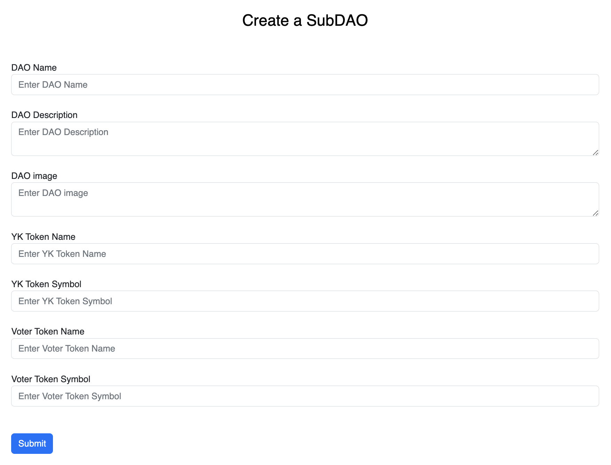

In this screen, admins can creata a sub-DAO which is a sub-organization of the current DAO. When created, it will be visible under current DAO's 'subDAOs' section.

The form to create a subDAO is like this:

Filling and pressing 'Submit' button will invoke Metamask to get signature from you, and upon successful transaction, a new subDAO will be created.
