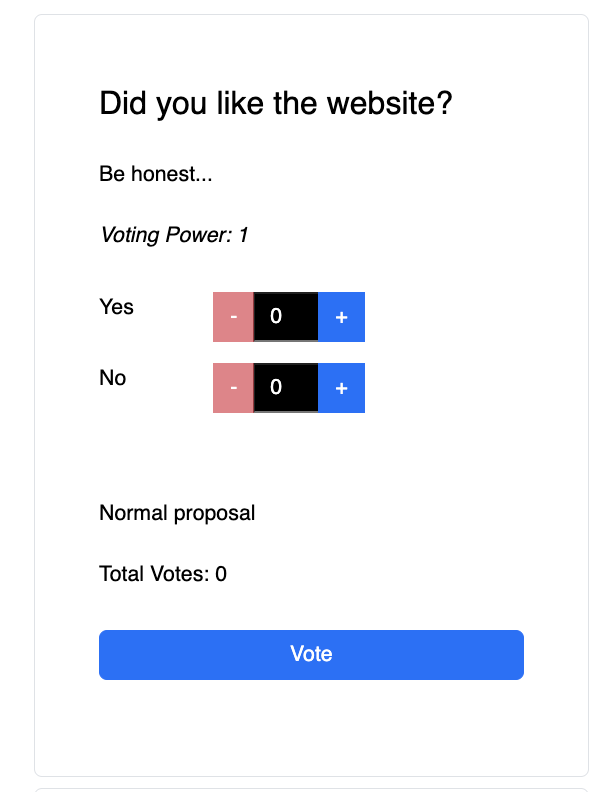

It is so easy to vote on proposals. As you can see in the image, there is a proposal/question and some options to choose from. You can vote between these options as the 'voting power' information suggests.

